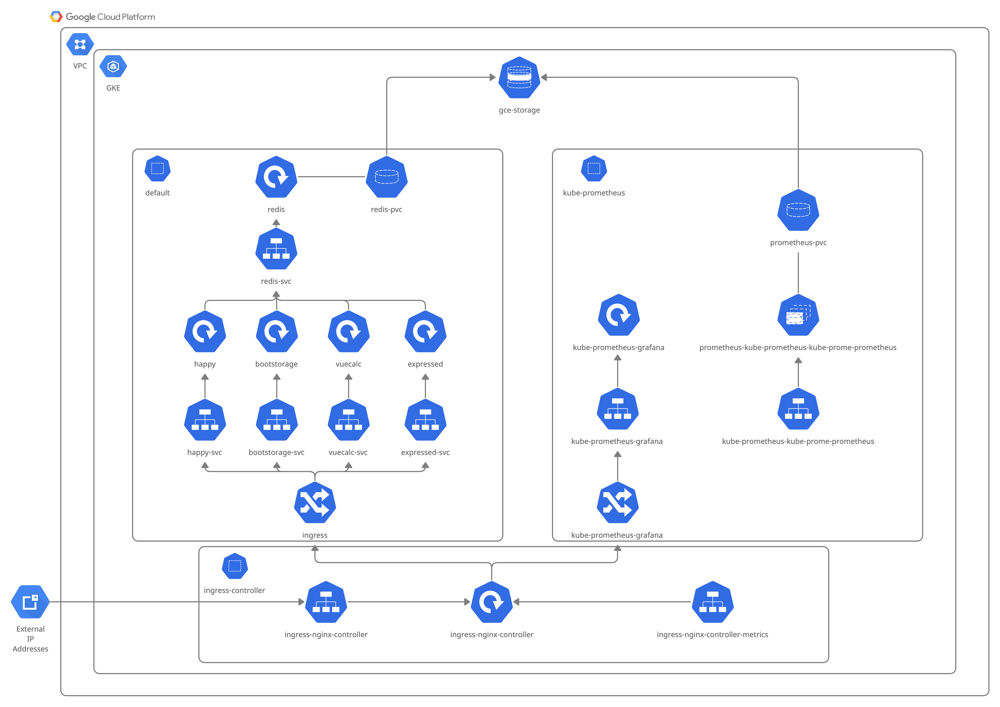
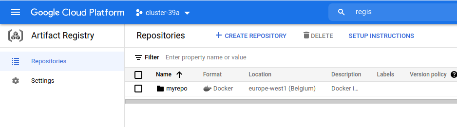
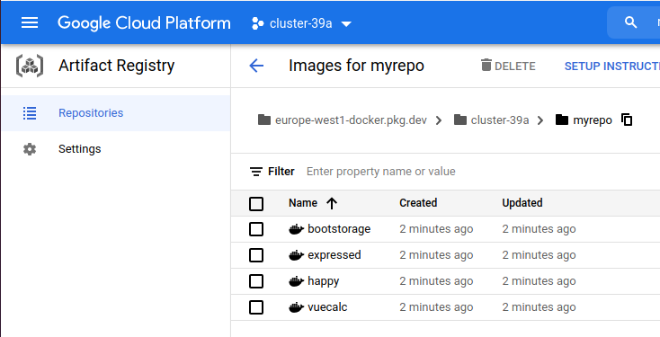
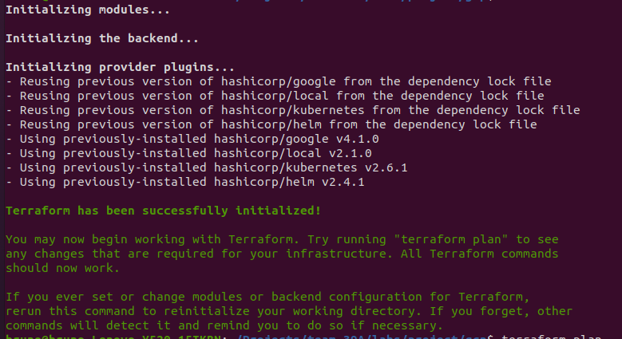
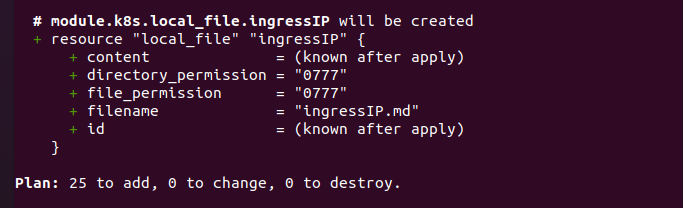
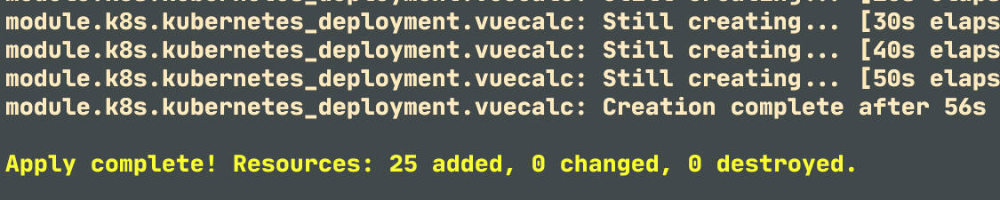
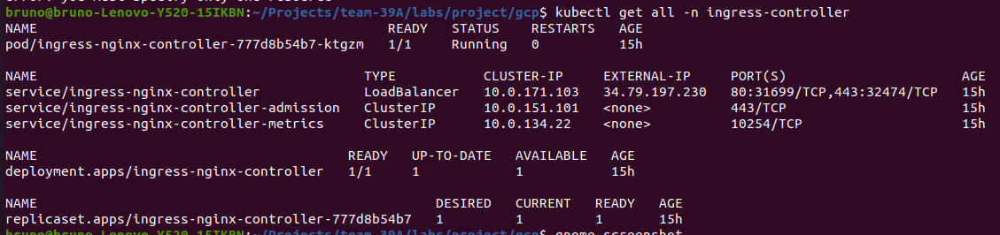

# A Scalable Microservices-based Web Application in a Public Cloud

AGISIT 20201-2022

Authors
============


| Number | Name              | Username                                       | Email										 |
| -------|-------------------|------------------------------------------------| ---------------------------------------------|
| 87704 | Samuel Vicente |[https://git.rnl.tecnico.ulisboa.pt/ist187704](https://git.rnl.tecnico.ulisboa.pt/ist187704) | [samuel.vicente@tecnico.ulisboa.pt](mailto:samuel.vicente@tecnico.ulisboa.pt) |
| 86392 | Bruno Dias |[https://git.rnl.tecnico.ulisboa.pt/ist186392](https://git.rnl.tecnico.ulisboa.pt/ist186392) | [bruno.ramos.dias@tecnico.ulisboa.pt](mailto:bruno.ramos.dias@tecnico.ulisboa.pt) |
| 92510 | Lúcia Silva | [https://git.rnl.tecnico.ulisboa.pt/ist192510](https://git.rnl.tecnico.ulisboa.pt/ist192510) | [lucia.silva@tecnico.ulisboa.pt](mailto:lucia.silva@tecnico.ulisboa.pt) |


Final Grade
============
20/20

Project Overview
============

This project describes the process of deploying and provisioning a micro services based containerized web application in a public cloud provider, in our case, Google Cloud Platform (GCP), using IaC tool [Terraform](https://www.terraform.io/).

The application to be deployed, [Kubernetes Starterkit](https://github.com/khandelwal-arpit/kubernetes-starterkit), is a simple browser-based calculator, using multiple distinct technologies, with a simple frontend and three backend services that provide the calculator operations (addition, multiplication, etc) and the executed operations history:

-   Vuecalc service (Vue.js);

-   Expressed service (Express.js);

-   Happy service (Hapi.js);

-   Bootstorage service (Java Spring Boot);

Vuecalc is a simple calculator UI frontend application that uses the endpoints exposed by the Expressed, Happy and Bootstorage backend applications.

Happy provides multiplication and division capabilities while Expressed provides addition and subtraction, both these services send the operations they execute to the bootstorage service in order to save the history of operations, this history can then be observed in the Vuecalc application.

Bootstorage is a simple service whose sole purpose is to store and return the operations executed in a [Redis Data Store](https://redis.io/).

Since the application was containerized, it made sense to use Kubernetes (K8S) for automatic deployment and management of the application containers. Google Kubernetes Engine (GKE) was used to create the cluster and Google Arctifact Registry (GAR) to manage and store container images.

There is a video regarding this project [here](https://youtu.be/PeXhR1QCIVk)

Architecture
============



We chose to build our cluster using GKE.

We then defined a StorageClass to use with the applications that need persistent storage, in our case, Redis and Prometheus.

All our services are cluster internal, meaning they do not have external IP addresses, this is by choice as we deemed better to use a reverse proxy to forward the requests from outside to inside the cluster. To accomplish this task we used the [NGINX Ingress Controller](https://kubernetes.github.io/ingress-nginx/). This serves as both the API gateway and reverse proxy. We defined two ingresses, one for each namespace that needed it, the default namespace and the kube-prometheus namespace. All the services inside the default namespace apart from the redis-svc are mapped to an API path in ingress. In the kube-prometheus namespace only the Grafana service is mapped to an API path in ingress .

Deployment
============

Pre-requisites
------------

In order to deploy our project there is a set of requirements that must be met.

First, lets overview what software needs to be installed in the machine that will preform the deployment. All software used was on the latest version as of November 2021;

-   Terraform;

-   Docker Engine;

-   npm;

-   JDK8;

-   maven;

-   gcloud;

-   awk;

-   bash;

Now that the required software is installed we can move on to setting up the GCP environment:

1.	Create a Project in Google Cloud Plataform;

	Go to dasboard and select (Select Project) followed by (New Project).

2.	Enable both Kubernetes Engine API and Artifact Registry API;

	In the APIs and Services of the google cloud plataform, search for both those APIs and enable them.

3.  Add Kubernetes Engine Service Agent Role to the Compute Engine default service account;

	Go to the `IAM & Admin > IAM` menu, and click on the pencil icon in the Compute Engine default service account, then `ADD ANOTHER ROLE` and select the Kubernetes Engine Service Agent role.

4.	Create the key.

	Go to the `IAM & Admin > Service Accounts` menu, click on the three dots (Actions) of the Compute Engine default service account and select `Manage Keys`. On this page click on `ADD KEY`, then `Create new key`, select the JSON type and click `CREATE`. Store this key in the `/gcp` directory of the project.

We can now set up the `/project/gcp/terraform.tfvars` file with the missing values, or change the already present ones.

``` bash
region       = "europe-west1"
zone         = "b"
project      = "<PROJECT_ID>"
credentials  = "<JSON_KEY_PATH>"
node_count   = 3
machine_type = "n1-standard-2"
secondary_ip_ranges = {
"pod_ip_range"      = "10.0.0.0/14"
"services_ip_range" = "10.4.0.0/19"
}
registry = "myrepo" # GAR repository ID to be created
grafana_password = "grafanamonitoring"
```

Artifact Registry Repository Creation
------------

In order to proceed to the image repository creation, a script located in the root of the project called build_push.md was created, responsible for:

-   Authenticating with gcloud;

-   Setting the project in gcloud;

-   Create the GAR repository in the GCP project;

-   Configure Docker to use this repository;

-   Build the MS images and push them to this repository;

```bash
$ ./build_push.sh
```





K8S cluster Provisioning and Deployment
------------

Go to the `/project/gcp` directory of the project and follow the following steps:

The following commands create and provision the infrastructure. The
outputs obtained should be similar to the ones presented.

```bash
$ terraform init
```



```bash
$ terraform plan
```



```bash
$ terraform apply auto-approve
```



Now, in order to access the cluster and run commands, kubectl is used, and can be configured with the following command. Zone and ProjectID correspond to your project's specifications.

```bash
$ gcloud container clusters get-credentials vpc-native-cluster --zone <Zone> --project <ProjectId>
```

Alternatively we can run the kubectl.sh file in the `/gcp` directory that already has these values set.
```sh
$ ./kubectl.sh
Fetching cluster endpoint and auth data.
kubeconfig entry generated for vpc-native-cluster.
```

In order to access the application, we need to retrieve the IP.

```bash
$ kubectl get all -n ingress-controller
```



We then copy the correspondent IP to a browser and we can access the application UI.

Alternatively we can cat the ingressIP.md file in the `/gcp` directory that already has external IP of the Ingress endpoint.
```bash
$ cat ingressIP.md
# Ingress IP address:
34.79.197.230
```

