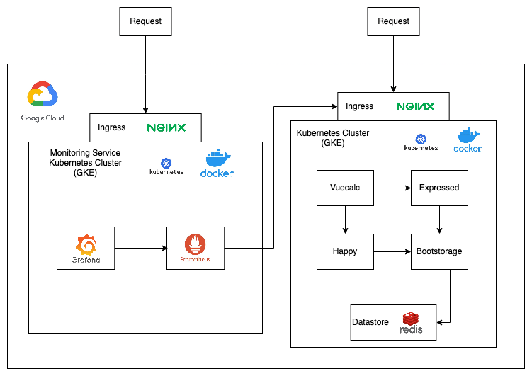

# Project Name

AGISIT 2021-20212

## Authors

**Team 39A**

| Number | Name              | Username                                       | Email										 |
| -------|-------------------|------------------------------------------------| ---------------------------------------------|
| 87704 | Samuel Vicente |[https://git.rnl.tecnico.ulisboa.pt/ist187704](https://git.rnl.tecnico.ulisboa.pt/ist187704) | [samuel.vicente@tecnico.ulisboa.pt](mailto:samuel.vicente@tecnico.ulisboa.pt) |
| 86392 | Bruno Dias |[https://git.rnl.tecnico.ulisboa.pt/ist186392](https://git.rnl.tecnico.ulisboa.pt/ist186392) | [bruno.ramos.dias@tecnico.ulisboa.pt](mailto:bruno.ramos.dias@tecnico.ulisboa.pt) |
| 92510 | Lúcia Silva | [https://git.rnl.tecnico.ulisboa.pt/ist192510](https://git.rnl.tecnico.ulisboa.pt/ist192510) | [lucia.silva@tecnico.ulisboa.pt](mailto:lucia.silva@tecnico.ulisboa.pt) |


## Solution Diagram



## Project overview
```
.
|-- README.md
|-- bootstorage/
|-- build_push.sh
|-- expressed/
|-- gcp
|   |-- gke
|   |   |-- cluster.tf
|   |   |-- outputs.tf
|   |   |-- provider.tf
|   |   |-- variables.tf
|   |   |-- vpc.tf
|   |-- k8s
|   |   |-- bootstorage.tf
|   |   |-- expressed.tf
|   |   |-- happy.tf
|   |   |-- ingress.tf
|   |   |-- output.tf
|   |   |-- provider.tf
|   |   |-- redis.tf
|   |   |-- variables.tf
|   |   |-- vuecalc.tf
|   |-- main.tf
|   |-- registry
|   |   |-- outputs.tf
|   |   |-- provider.tf
|   |   |-- registry.tf
|   |   |-- templates
|   |   |   |-- repo_id.tmpl
|   |   |-- terraform.tfvars
|   |   |-- variables.tf
|   |-- variables.tf
|-- happy/
|-- report/
|-- vuecalc/
```

In the root directory of our project we have the folder of the micro services, the `gcp` folder which contains everything necessary to create and provision the main Kubernetes cluster. 

There is also a script called `build_push.sh` that can be used to:

* authenticate with gcloud;
* set the project;
* create the Artifact registry in the Google Cloud Platform project;
* configure Docker to use this registry;
* build the micro services images and push them to this Artifact Registry;

In order to this to happen the user must have installed the following software:

* Maven
* Docker
* Terraform

Additionally the `terraform.tfvars` must be created in the `registry` folder with the necessary data.

### Infrastructure

We started with the idea of achieving a "one click" solution, i.e. running `terraform apply` on the `gcp` folder and all would magically be created. We thought of using different modules on the `main.tf`file one for the creation of the Registry, one for the creating of the Cluster and another to provision it.

This was unfortunately impossible to do.

To do that would imply that the registry would be empty when the cluster was provisioned.

To overcome this issue we decided to separate things. Now the `main.tf` file would only create and provision the cluster, while the creation of the Registry would be a different procedure.

To create the Artifact Registry, which holds the images of the micro services we planned on deploying in the cluster, we created the module `registry`.

This registry is tailored to hold Docker images.

To achieve a near "one click" solution we made the `build_push.sh` script.

With this we can proceed to the next phase, the creating and provision of the cluster.

To create the cluster one must run `terraform init` and `terraform apply` in the `gcp` folder, this will first call the module `gke` which will:

* create a VPC network with a subnet with 2 `secondary_ip_ranges`, one for pods the other for services;
* create a cluster using this network with no initial nodes and allocate the IP ranges to the pods and services;
* Create a Node pool;

After this is created the cluster can be provisioned.

To provision the cluster we created the module `k8s` which as the definitions of the pods and services, each file as the corresponding configurations for both the service and deployment/statefulSet.


## Versioning

We use [RNL Git](https://git.rnl.tecnico.ulisboa.pt/) for versioning.
